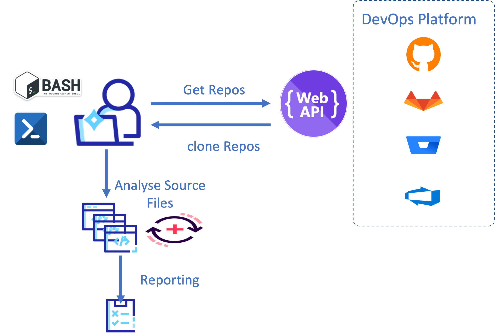

## LoC Counting Scripts
This is a collection of shell scripts that demonstrate how to count lines of code from repositories and/or local directories. These scripts can be used to **estimate** LoC counts that would be produced by a Sonar analysis of these projects, without having to implement this analysis.

These scripts that connect to a DevOps platform must be run in a blank workspace (without data).

To exclude directories or files from the scan, you can insert the names of these exclusions into the **.clocignore** file in the environment where you run the scripts. Example :

> bootstrap
> 
> test

* [Installation](#installation)
* [General usage](#general-usage)
* [Contributions and Feedbacks](#Contributions-and-feedbacks)



## Installation
Requirements:

* bash version 4+
* [Git](https://git-scm.com/)
* [curl](https://curl.haxx.se)
* [jq](https://stedolan.github.io/jq/)
* [cloc](https://github.com/AlDanial/cloc/releases/tag/v1.96)  installed v1.96
* For Mac OSX you need gnu-sed (brew install gnu-sed)

## General usage
Most scripts will produce two reports of LoC by language (.lang) and by repository (.file).

### [github.com](https://github.com):
Counts lines of code from a GitHub.com organization. Requires to pass username, [personal access token](https://docs.github.com/en/authentication/keeping-your-account-and-data-secure/creating-a-personal-access-token) and the organization. The token must have repo scope. The script generates a report per project (File: ***ProjectName.txt***) that indicates the number of lines of code per branch and indicates the branch that has the highest number of lines of code. As well as a ***Report_global.txt*** file that indicates the maximum line of code on the repository.

```
<github_com.sh> <user> <token> <organization>
github_com.sh myuser 1234567890abcdefgh myGitHubDotComOrg
```
or
```
<github_com.sh> <user> <token> <organization> <MyRepoName>
github_com.sh myuser 1234567890abcdefgh myGitHubDotComOrg MyRepoName
```

### [bitbucket.org](https://bitbucket.org):
Counts lines of code from a Bitbucket.org organization. Requires passing username (e.g. email), [API token](https://support.atlassian.com/bitbucket-cloud/docs/api-tokens/) with `read:repository:bitbucket` scope, and the workspace slug. The script generates a report per project (File: ***ProjectName.txt***) that indicates the number of lines of code per branch and indicates the branch that has the highest number of lines of code. As well as a ***Report_global.txt*** file that indicates the maximum line of code on the repository.

```
<bitbucket_org.sh> <user> <apiToken> <myWorkspace>
bitbucket_org.sh myuser 1234567890abcdefgh myBBWorkspace
```
or
```
<bitbucket_org.sh> <user> <PasswordToken> <myWorkspace> <MyProjectName>
<bitbucket_org.sh> myuser 1234567890abcdefgh myBBWorkspace MyProjectName
```
If you have more than 100 repos, you need to change Value of parameter page=Number_of_page on line 53

       1 Page = 100 repos max
       Example for 150 repos : GetAPI="repositories/$wks?pagelen=100&page=2"

### [Azure DevOps Services](https://dev.azure.com):
Counts lines of code from a Azure DevOps Services organization. Requires to pass [personal access token](https://docs.microsoft.com/en-us/azure/devops/organizations/accounts/use-personal-access-tokens-to-authenticate?view=azure-devops) and the organization.  The token must have Code > Read permissions.
The script generates a report per project (File: ***ProjectName.txt***) that indicates the number of lines of code per branch and indicates the branch that has the highest number of lines of code. As well as a ***Report_global.txt*** file that indicates the maximum lines of code on the repository.

```
<azure_devops_services.sh> <token> <organization>
azure_devops_services.sh 1234567890abcdefgh myADOOrg 
```
or
```
<azure_devops_services.sh> <token> <organization> <MyProjectName>
azure_devops_services.sh 1234567890abcdefgh myADOOrg MyProjectName
```

### [Gitlab.com](https://gitlab.com):
Counts lines of code from a GitLab.com Group or Project. Requires passing [personal access token](https://docs.gitlab.com/ee/user/profile/personal_access_tokens.html) and the group.  The token must have read_api and read_repository scopes. The script generates a report per project (File: ***ProjectName.txt***) that indicates the number of lines of code per branch and indicates the branch that has the highest number of lines of code. As well as a ***Report_global.txt*** file that indicates the maximum line of code on the repository.


```
<gitlab_com.sh> <token> <groupName>
gitlab_com.sh 1234567890abcdefgh myGitLabGroupName
```
or
```
<gitlab_com.sh> <token> <groupName/MyProjectName> 
gitlab_com.sh 1234567890abcdefgh myGitLabGroupName/MyProjectName
```
If you have more than 100 repos, you need to change Value of parameter page=Number_of_page on line 58 or 61

       1 Page = 100 repos max
       Example for 150 repos :  GetAPI="/projects/$groupname1?per_page=100&page=2"
       
### Local Filesystem:
Counts lines of code from a local directory or file. The script generates a report file : Report_***Name-of-Directory***.txt

```
<filesystem.sh> PathToDirectory
```

Contributions and feedbacks
-------------
Contributions and feedbacks are welcome, as PRs or issues directly with this repository, or through your established Sonar communication channel.
